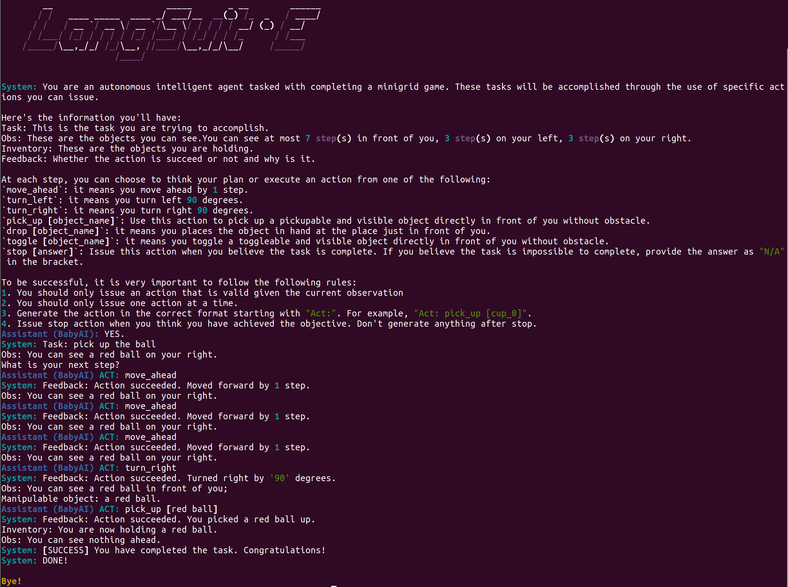
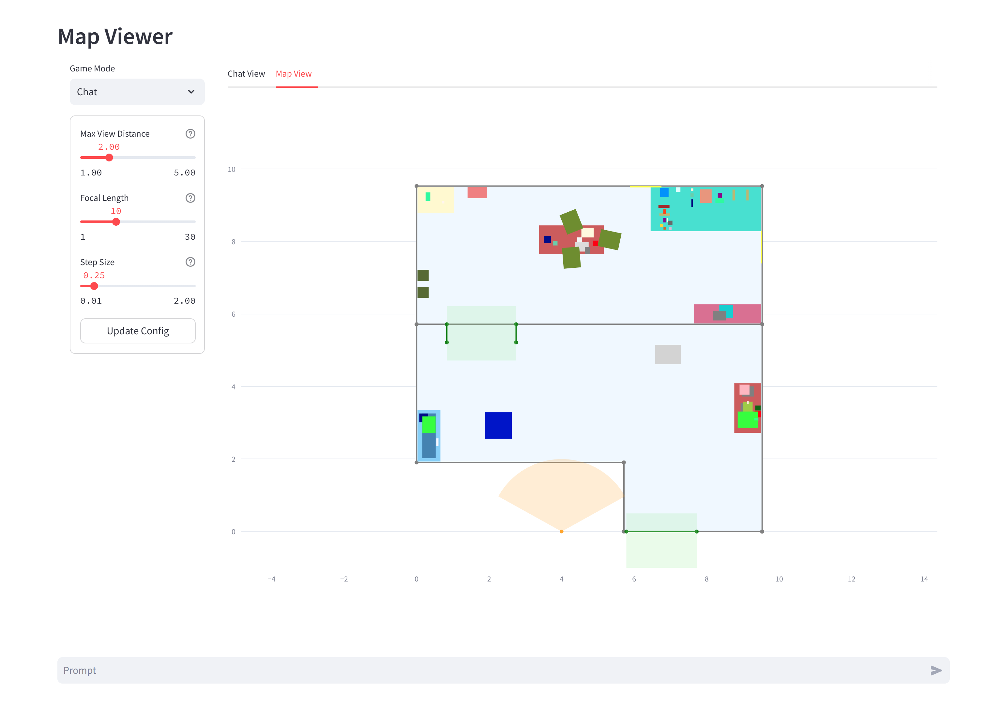

<h1 align="center" > 🏘️ LangSuit⋅E </h1>
<h3 align="center">Controlling, Planning, and Interacting with Large Language Models in Embodied Text Environments</h3>

<p align="center">
    <a href="https://opensource.org/licenses/MIT">
        
    </a>
    <a href="https://www.python.org/downloads/release/python-380/">
        
    </a>
</p>
<a name="overview"></a>


 **LangSuit⋅E** is a systematic and simulation-free testbed for evaluating embodied capabilities of large language models (LLMs) across different tasks in embodied textual worlds. The highlighted features include:
 - **Embodied Textual Environments**: The testbed provides a general simulation-free textual world that supports most embodied tasks, including navigation, manipulation, and communications. The environment is based on [Gymnasium](https://gymnasium.farama.org/index.html) and inherits the design patterns.
 - **Embodied Observations and Actions**: All agents' observations are designed to be embodied with customizable `max_view_distance`, `max_manipulate_distance`, `focal_length`, *etc*.
 - **Customizable Embodied Agents**: The agents in LangSuit⋅E are fully-customizable *w.r.t* their action spaces and communicative capabilities, *i.e.*, one can easily adapt the communication and acting strategy from one task to another.
 - **Multi-agent Cooperation**: The testbed supports planning, acting and communication among multiple agents, where each agent can be customized to have different configurations.
 - **Human-agent Communication**: Besides communication between agents, the testbed supports communication and cooperation between humans and agents.
 - **Full support to [LangChain](https://www.langchain.com/) library**: The LangSuitE testbed supports full usage of API language models, Open-source language models, tool usages, Chain-of-Thought (CoT) strategies, *etc.*.
 - **Expert Trajectory Generation**: We provide expert trajectory generation algorithms for most tasks.


## Table of Contents
- [🔍 Overview](#overview)
- [⚠️ Upgrade Warning !!!](#warning)
- [📦 Benchmark and Dataset](#-benchmark-and-dataset)
- [🛠 Getting Started](#-getting-started)
  - [Installation](#installation)
  - [Quick Start](#quick-start-commandline-interface-default)
  - [Task Configuration](#task-configuration)
  - [Prompt Template](#prompt-template)
- [📝 Citation](#-citation)
- [📄 Acknowledgements](#-acknowledgements)

## ⚠️ Upgrade Warning !!!

We are currently refactoring and upgrading LangSuit·E. As of now, the following features are *temporarily* offline. If you have an urgent need, you can find our old version in the [dev branch](https://github.com/bigai-nlco/langsuite/tree/dev). If you discover any bugs in the new version or wish for us to prioritize certain features, feel free to tell us in the issues.

Below is our priority list:

- [ ] Support interactive WebUI (currently WebUI can render the picture of scene, but do not support interactive actions)
- [ ] Support Gymnasium API (will provide better support for BabyAI and more tasks)
- [ ] Refactored Expert Agent for IQA, Rearrenage and BabyAI. 
- [ ] More deeply integration with LangChain
- [ ] Support multi-room and multi-agent (TEACh and CWAH need it)
- [ ] Better support for AI2-THOR and ProcTHOR based tasks
- [ ] Support VirtualHome format (CWAH need it)

## 📦 Benchmark and Dataset

We form a benchmark by adapting from existing annotations of simulated embodied engines, a by-product benefit of pursuing a general textual embodied world. Below showcase 6 representative embodied tasks, with variants of the number of rooms, the number of agents, and the action spaces of agents (whether they can communicate with each other or ask humans).

<div align="center">
<table>
  <tr>
    <th>Task</th>
    <th>Simulator</th>
    <th># of Scenes</th>
    <th># of Tasks</th>
    <th># of Actions</th>
    <th>Multi-Room</th>
    <th>Multi-Agent</th>
    <th>Communicative</th>
  </tr>
  <tr>
    <td><a href="https://github.com/Farama-Foundation/Minigrid">BabyAI</a></td>
    <td>Mini Grid</td>
    <td align="center">105</td>
    <td align="center">500</td>
    <td align="center">6</td>
    <td align="center">&#10003;</td>
    <td align="center">&#10007;</td>
    <td align="center">&#10007;</td>
  </tr>
  <tr>
    <td><a href="https://github.com/allenai/ai2thor-rearrangement">Rearrange</a></td>
    <td>AI2Thor</td>
    <td align="center">120</td>
    <td align="center">500</td>
    <td align="center">8</td>
    <td align="center">&#10007;</td>
    <td align="center">&#10007;</td>
    <td align="center">&#10007;</td>
  </tr>
  <tr>
    <td><a href="https://github.com/danielgordon10/thor-iqa-cvpr-2018">IQA</a></td>
    <td>AI2Thor</td>
    <td align="center">30</td>
    <td align="center">3,000</td>
    <td align="center">5</td>
    <td align="center">&#10007;</td>
    <td align="center">&#10007;</td>
    <td align="center">&#10003;</td>
  </tr>
  <tr>
    <td><a href="https://github.com/askforalfred/alfred">ALFred</a></td>
    <td>AI2Thor</td>
    <td align="center">120</td>
    <td align="center">506</td>
    <td align="center">12</td>
    <td align="center">&#10007;</td>
    <td align="center">&#10007;</td>
    <td align="center">&#10007;</td>
  </tr>
  <tr>
    <td><a href="https://github.com/alexa/teach">TEACh</a></td>
    <td>AI2Thor</td>
    <td align="center">120</td>
    <td align="center">200</td>
    <td align="center">13</td>
    <td align="center">&#10007;</td>
    <td align="center">&#10003;</td>
    <td align="center">&#10003;</td>
  </tr>
  <tr>
    <td><a href="https://vis-www.cs.umass.edu/Co-LLM-Agents/">CWAH</a></td>
    <td>Virtual Home</td>
    <td align="center">2</td>
    <td align="center">50</td>
    <td align="center">6</td>
    <td align="center">&#10003;</td>
    <td align="center">&#10003;</td>
    <td align="center">&#10003;</td>
  </tr>


</table>

</div>

## 🛠 Getting Started
### Installation
1. Clone this repository
```bash
git clone https://github.com/langsuite/langsuite.git
cd langsuite
```
2. Create a conda environment with `Python3.8+` and install python requirements
```bash
conda create -n langsuite python=3.8
conda activate langsuite
pip install -e .
```
3. Export your `OPENAI_API_KEY` by
```bash
export OPENAI_API_KEY="your_api_key_here"
```
or you can customize your APIs by
```bash
cp api.config.yml.example api.config.yml
```
and add or update your API configurations. For a full API agent list, please refer to [LangChain Chat Models](https://python.langchain.com/docs/integrations/chat/).

4. Download the task dataset by
```bash
bash ./data/download.sh <data name>
```
Currently supported datasets include: `alfred`, `babyai`, `cwah`, `iqa`, `rearrange`.


### Quick Start: CommandLine Interface (Default)

```bash
langsuite task <config-file.yml>
```




### Quick Start: Interactive Web UI
1. Start langsuite server

```bash
langsuite serve <config-file.yml>
```

2. Start webui

```bash
langsuite webui
```
The user inferface will run on http://localhost:8501/




### Task Configuration
```yaml
task: AlfredTask_V0

template: ./templates/alfred/alfred_react.json

world:

agents:
  - type: ChatAgent
    inventory_capacity: 5
    focal_length: 10
    max_manipulate_distance: 2
    max_view_distance: 2
    step_size: 0.25

```

### Prompt Template
```json
{
    "intro": {
        "default": [
            "As an autonomous intelligent agent, you are now navigating a virtual home, and your task is to perform household tasks using specific actions. You will have access to the following information:  ..."
        ]
    },
    "example": {
        "default": [
            "Task: put a clean lettuce in diningtable.\nObs: In front of you, You see a stoveburner_2. On your left, you see a stoveburner_1; a sinkbasin_1. On your right, you see a countertop_1; a tomato_0; a toaster_0.\n> Act: turn_left ..."
        ]
    },
    "InvalidAction": {
        "failure.invalidObjectName": [
            "Feedback: Action failed. There is no the object \"{object}\" in your view space. Please operate the object in sight.\nObs: {observation}"
        ],
        ...
    },
    ...
}

```

## 📝 Citation
If you find our work useful, please cite
```bibtex
@misc{langsuite2023,
  author    = {Zilong Zheng, Zixia Jia, Mengmeng Wang, Wentao Ding, Baichen Tong, Songchun Zhu},
  title     = {LangSuit⋅E: Controlling, Planning, and Interacting with Large Language Models in Embodied Text Environments},
  year      = {2023},
  publisher = {GitHub},
  url       = {https://github.com/bigai-nlco/langsuite}
}
```

For any questions and issues, please contact [nlp@bigai.ai](mailto:nlp@bigai.ai).

## 📄 Acknowledgements
 Some of the tasks of LangSuit⋅E are based on the datasets and source-code proposed by previous researchers, including [BabyAI](https://github.com/Farama-Foundation/Minigrid), [AI2Thor](https://github.com/allenai/ai2thor-rearrangement), [ALFred](https://github.com/askforalfred/alfred), [TEAch](https://github.com/alexa/teach), [CWAH](https://vis-www.cs.umass.edu/Co-LLM-Agents/).
